## is this thing on

With a complete rewrite from scratch, I have made the second rendition of my website! Notably, I tried my hand at
creating a [Jekyll](https://jekyllrb.com/) blog-like interface to make adding content here a slick experience.

Below is a brief rundown of how this post is currently within your possession and readable.


## markdown is great

I love Markdown, truly. Universal and easy to pick up, and Obsidian! Jekyll is a static site generator which makes
it easy to host a site using basic Markdown and HTML constructs. A simple Jekyll + GitHub Pages website can be deployed within minutes, with blog posts being simple Markdown files that are rendered by the engine.

I previously did just this, and took time to use Sass to make my own theme and make some basic pages. While remaking my site with a simple React + TypeScript stack, I thought about how to still have a blog system with easy-to-write posts. Markdown files as a standard format still seemed the route of least friction, and so I had to find a solution for rendering Markdown within the typical React ecosystem.

### marking and hyping

[`remark`](https://github.com/remarkjs) is a framework of plugins that are used to transform and render Markdown content. Similarly, [`rehype`](https://github.com/rehypejs) supports HTML transformations. [`react-markdown`](https://github.com/remarkjs/react-markdown) is a React component that can plug-n-play both rehype and remark plugins.

To this end, I created a `MarkdownRenderer` wrapper around the `MarkdownAsync` component from `react-markdown`, as certain plugins require async rendering. I really enjoy LaTeX/MathJax and Mermaid support in Markdown along with [GitHub flavored Markdown](https://github.github.com/gfm/), so I composed `remark-math` + `rehype-mathjax`, `rehype-mermaid`, and `remark-gfm`.

MathJax supports its own context menu with the ability to copy the raw LaTeX (!), so I opted to load in the MathJax script rather than displaying it in the CHTML format. Try it out, see more by right-clicking:

$$y = mx + b$$

Next up was rendering syntax-highlighted codeblocks, with an easy copy-to-clipboard functionality. `react-markdown` allows for passing in custom components, which are used to process its input content. [`react-syntax-highlighter`](https://github.com/react-syntax-highlighter/react-syntax-highlighter) does nearly all of this, a quick little copy functionality, and _not_ processing `mermaid` so `rehype-mermaid` can read it, and we're good to go.

## if file, where?

Now that we had our hefty, but thankfully async, `MarkdownRenderer`, I now needed to build a system from which the client would fetch the Markdown files.

For a site as simple as this, a simple static, client-side architecture makes sense. Currently, the site is being hosted statically
on GitHub Pages, where the Markdown files are served from a static `public/posts` folder. Each post's metadata is indexed
into a JSON file which is fetched into a global context.

```json
[
  {
    "slug": "testing",
    "title": "/testing-css",
    "date": "2025-02-23",
    "tags": []
  }
]
```

Once a post is navigated to, the entire content of its Markdown file is fetched and processed. Since we went through the
whole ordeal of processing the Markdown content, a Least Recently Used (LRU) cache is in place to store the contents of the last ~twenty
posts that have been viewed.

The slug is how individual posts are identified and fetched quickly in the internal hashmap of `slug: PostMeta(data)`. So far, a slug is simply putting hyphens `-` between words of a post title.

To maintain the `index.json` crucial for the post system, a quick Python script is used as CLI tool to add, edit metadata, and delete posts and automatically update the index so posts are never out of place. For Neovim, I recommend [live-preview.nvim](https://github.com/brianhuster/live-preview.nvim) to easily edit Markdown files in real time similar to VS Code's built-in previewer, without having to spin-up the entire website in dev.

TL;DR:

```mermaid
flowchart TD
    Client["🖥️ Client"]:::ui

    subgraph GitHubPages["🌐 GitHub Pages: Static"]
        JSONIndex["<code>posts/index.json</code> (metadata index)"]:::data
        PublicPosts["<code>/public/posts/*.md</code> (raw Markdown files)"]:::data
    end

    subgraph React["⚛️ React State"]
        Context["<code>PostsContext</code> (global state)"]:::state
        LRUCache["LRU Cache (~20 recent posts)"]:::state
        MarkdownRenderer["<code>MarkdownRenderer</code> (async parser + renderer)"]:::process
        LoadPosts["<code>loadPosts</code>: list of all posts"]:::process
        LoadOnePost["<code>loadOnePost</code>: raw content of one post"]:::process
    end

    JSONIndex --> LoadPosts
    LoadPosts -->|Post metadata| Context
    PublicPosts --> LoadOnePost

    MarkdownRenderer -->|Processed HTML| Client

    LoadOnePost -->|Raw Markdown| MarkdownRenderer
    LRUCache -->|Cache hit: serve single post| MarkdownRenderer
    LRUCache -->|Cache miss: fetch post| LoadOnePost

    Client -->|Fetch posts' metadata| LoadPosts
    Client -->|On navigation: fetch *.md| LRUCache

    classDef data fill:#e8f5e8,stroke:#4caf50,stroke-width:2px,color:#2e7d32;
    classDef state fill:#e3f2fd,stroke:#2196f3,stroke-width:2px,color:#1565c0;
    classDef process fill:#fff8e1,stroke:#ff9800,stroke-width:2px,color:#ef6c00;
    classDef ui fill:#f3e5f5,stroke:#9c27b0,stroke-width:2px,color:#6a1b9a;
```



### the entire page is being cached?

You're right, there's room for optimization here. Perhaps caching the first few lines of each post so the initial render works seamlessly, then re-processing the rest can save quite the storage by being known.

Lazy-loading content like this is actually being used for the MathJax with its [lazy-loading mechanism](https://docs.mathjax.org/en/latest/output/lazy.html), typesetting content only when the math is `lazyMargin` pixels away from the current viewport.

## closing

I enjoyed re-creating my website, and making it better than ever in terms of design and engineering. While still rough around the edges, I am proud of the renovations to this place, and I want to continue iterating on making this a very performant, aesthetic, and easy-to-main bundle of ~75 files.

A rough roadmap would be
1. Setting my never-ending typography itches.
2. Being smarter about caching posts, and perhaps a better fetching mechanism.
3. Should we worry *now* about potential post-slug collisions? Probably not.

Thanks for making it all the way to this line, have a good one :)
